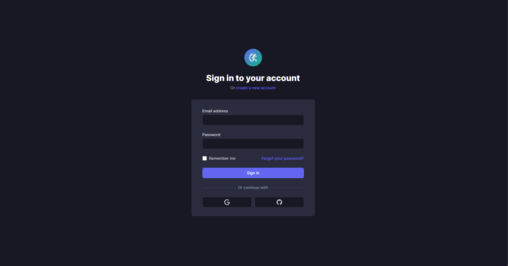

# ThinkForge Chat Application

A modern, sleek chat interface with AI capabilities, built with the MERN stack (MongoDB, Express, React, Node.js).

## Features

- Modern UI inspired by ChatGPT
- Real-time chat with AI responses
- User authentication and authorization
- Conversation management
- Markdown support for rich text formatting
- Code syntax highlighting
- Mobile-responsive design

## Tech Stack

### Frontend
- React with TypeScript
- Vite for fast development
- Tailwind CSS for styling
- React Markdown for rendering markdown
- Syntax highlighting for code blocks
- Lucide React for icons

### Backend
- Node.js with Express
- MongoDB with Mongoose
- JWT for authentication
- RESTful API architecture

## Getting Started

### Prerequisites
- Node.js (v14 or higher)
- MongoDB (local or Atlas)

### Installation

1. Clone the repository
```
git clone <repository-url>
cd thinkforge
```

2. Install dependencies
```
npm install
```

3. Set up environment variables
Create a `.env` file in the backend directory with the following variables:
```
PORT=5000
MONGODB_URI=mongodb://localhost:27017/thinkforge
JWT_SECRET=your_jwt_secret
NODE_ENV=development
```

4. Start the development server
```
# Start the backend server
npm run server

# In a separate terminal, start the frontend
npm run dev
```

## Project Structure

```
thinkforge/
├── backend/               # Backend code
│   ├── controllers/       # Request handlers
│   ├── middleware/        # Express middleware
│   ├── models/            # Mongoose models
│   ├── routes/            # API routes
│   ├── utils/             # Utility functions
│   └── server.js          # Entry point
├── public/                # Static files
├── src/                   # Frontend code
│   ├── components/        # React components
│   ├── services/          # API services
│   ├── types/             # TypeScript types
│   ├── utils/             # Utility functions
│   ├── App.tsx            # Main component
│   └── main.tsx           # Entry point
├── .env                   # Environment variables
└── package.json           # Project dependencies
```

## API Endpoints

### Authentication
- `POST /api/auth/register` - Register a new user
- `POST /api/auth/login` - Login user
- `GET /api/auth/me` - Get current user

### Conversations
- `GET /api/conversations` - Get all conversations
- `GET /api/conversations/:id` - Get a single conversation
- `POST /api/conversations` - Create a new conversation
- `PUT /api/conversations/:id` - Update a conversation
- `DELETE /api/conversations/:id` - Delete a conversation

### Messages
- `GET /api/messages/:conversationId` - Get all messages for a conversation
- `POST /api/messages/:conversationId` - Create a new message
- `POST /api/messages/:conversationId/generate` - Generate AI response

## Future Enhancements

- Real AI model integration
- Real-time updates with Socket.io
- Voice input and output
- File uploads and sharing
- User preferences and settings
- Advanced conversation management
- Export conversations

## Perview

Login /Sign up Page


